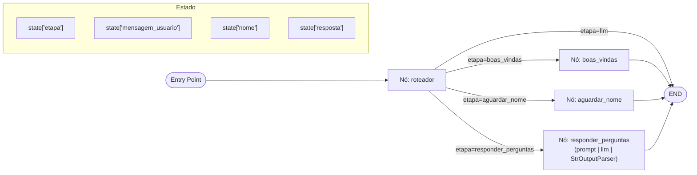

## TechAdvisor – Agente conversacional com LangChain + LangGraph

Um agente conversacional simples que dá boas‑vindas, coleta o nome do usuário e entra em um ciclo de perguntas e respostas (Q&A) sobre tecnologia. Ele demonstra, de forma didática, como:
- **carregar variáveis de ambiente** com `python-dotenv`;
- **construir prompts** com `PromptTemplate` (LangChain);
- **orquestrar um fluxo** com `LangGraph` utilizando um `StateGraph` com múltiplos nós e arestas condicionais;
- **conectar um LLM Gemini (Google)** via `langchain-google-genai` usando a interface moderna (LCEL): `prompt | llm | StrOutputParser()`.

### Por que este projeto?
- Ideal para bootcamps e primeiros passos em agentes de IA.
- Código curto, claro e comentado para facilitar o aprendizado.

---

## Pré‑requisitos
- Python 3.12+ (recomendado)
- Conta e chave de API do Google AI Studio (Gemini)
- macOS, Linux ou Windows com terminal

---

## Setup rápido (macOS/Linux)

1) Clonar o repositório (ou abrir a pasta no seu ambiente):
```bash
cd /Users/seu-usuario/algum/lugar
git clone <seu-repo>.git
cd akcit/akcit-camp-2025/dia1
```

2) Criar e ativar o ambiente virtual:
```bash
python3 -m venv .venv
source .venv/bin/activate
```

3) Instalar as dependências específicas do agente:
```bash
pip install -r techadvisor/requirements.txt
```

4) Configurar as variáveis de ambiente:
```bash
cp .env-sample .env
# edite o arquivo .env e coloque sua chave real
# GOOGLE_API_KEY=AIza....
```

> Dica: O arquivo `.env-sample` já existe na raiz do projeto. É só copiar para `.env` e preencher a chave.

### Windows (PowerShell)
```powershell
py -m venv .venv
.\.venv\Scripts\Activate.ps1
pip install -r techadvisor\requirements.txt
copy .env-sample .env
# edite .env e informe GOOGLE_API_KEY
```

---

## Como rodar
Com o ambiente virtual ativo e `.env` configurado:
```bash
python techadvisor/techadvisor_agent.py
```

Exemplo de conversa (CLI):
```
🤖 TechAdvisor - Agente conversacional sobre tecnologia

Olá! Eu sou o TechAdvisor. Como posso te chamar?

Você: Maria

🔎 Agente: Prazer, Maria! Como posso ajudar em tecnologia hoje?

Você: Quero aprender back-end com Python

🔎 Agente: Recomendo começar por FastAPI para criar APIs modernas...

Você: tchau

🔎 Agente: Até logo, Maria! 👋

Conversa encerrada.
```

Para encerrar, digite `sair`/`exit`/`quit` (comando do app) ou diga `tchau` (condição do grafo).

---

## Como funciona (arquitetura didática)

- `PromptTemplate` (LangChain): define o texto-base para Q&A com variáveis `{nome}` e `{pergunta}`.
- `ChatGoogleGenerativeAI` (langchain-google-genai): cria o LLM (Gemini) a ser usado.
- `LCEL` (LangChain Expression Language): conectamos `prompt | llm | StrOutputParser()` formando uma pipeline:
  - `prompt` injeta `{nome}` e `{pergunta}`
  - `llm` gera a resposta
  - `StrOutputParser()` garante que o resultado final seja string limpa
- `LangGraph`:
  - Estado: `{ "etapa", "mensagem_usuario", "nome", "resposta", "historico", ... }`.
  - Nó `boas_vindas`: envia saudação e pergunta o nome. Transição para `aguardar_nome`.
  - Nó `aguardar_nome`: espera input do usuário e extrai o nome. Transição para `responder_perguntas`.
  - Nó `responder_perguntas`: responde usando LLM e mantém um loop (aresta para si mesmo via roteamento) até o usuário dizer "tchau".
  - Condição de término: se a mensagem contém "tchau", transição para `END`.
  - Um nó `roteador` decide, a cada turno, qual nó executar baseado em `state['etapa']`.

### Diagrama do grafo (Mermaid)



---

## Estrutura dos arquivos
- `techadvisor/techadvisor_agent.py`: código do agente (altamente comentado).
- `techadvisor/requirements.txt`: dependências específicas.
- `.env-sample`: modelo de variáveis de ambiente (na raiz do projeto).

---

## Personalizações comuns

- **Trocar o modelo**: no arquivo `techadvisor_agent.py`, altere `model="gemini-2.0-flash"` para outro modelo compatível na sua conta (ex.: `gemini-1.5-flash`).
- **Ajustar criatividade**: modifique `temperature=0.7`.
- **Mudar o prompt**: edite o `template_text` para orientar o agente a outro domínio (por exemplo, carreiras, cloud, dados, etc.).
- **Adicionar etapas**: inclua nós adicionais (ex.: validação, desambiguação) e conecte via `add_conditional_edges`.

---

## Interface web (Gradio)

Você pode iniciar um chat web simples com:

```bash
python techadvisor/agente_gui.py
```

Recursos:
- Chatbot com estado (cada mensagem roda um turno no LangGraph)
- Comando `/reset` para reiniciar a conversa
- Dica: também é possível encerrar dizendo "tchau" (condição do grafo)


