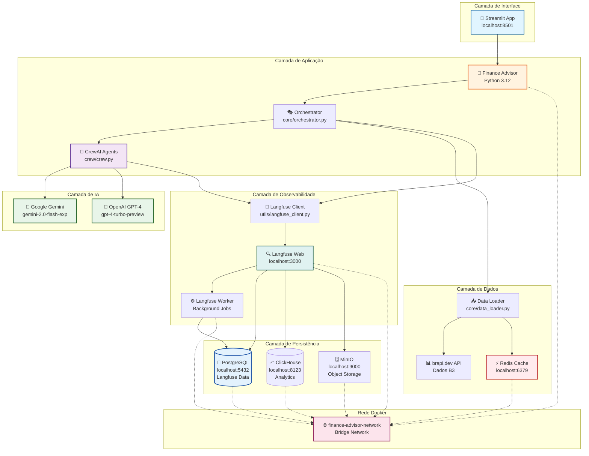

# 💰 Finance Advisor – Dividend Analyst

Sistema multi-agente avançado para análise comparativa de dividendos de ações brasileiras com **observabilidade completa via Langfuse**. Combina dados em tempo real da B3, orquestração com **CrewAI**, LLMs (OpenAI/Gemini) e **infraestrutura containerizada**.

## 🌟 Por que este projeto?

- 🤖 Arquitetura completa de **IA multi-agente** com CrewAI
- 📊 **Observabilidade em tempo real** com Langfuse (tracing de LLMs e agentes)
- 🐳 **100% containerizado** com Docker Compose (fácil deploy)
- ⚡ Sistema de **cache inteligente** com Redis
- 🎨 Interface web moderna com Streamlit
- 📈 Integração com **APIs financeiras** (brapi.dev)
- 🔧 Ideal para bootcamps e estudos de arquitetura de IA

---

### 📊 Fluxo de Dados

1. **Usuário** → Streamlit UI (localhost:8501)
2. **Streamlit** → Orchestrator (processa requisição)
3. **Orchestrator** → Data Loader (busca dados financeiros)
4. **Data Loader** → Redis Cache (verifica cache)
5. **Data Loader** → brapi.dev API (se não estiver em cache)
6. **Orchestrator** → CrewAI (inicia análise multi-agente)
7. **CrewAI** → Gemini/OpenAI (gera insights com IA)
8. **CrewAI** → Langfuse Client (registra traces)
9. **Langfuse Client** → Langfuse Web (envia telemetria)
10. **Langfuse Web** → PostgreSQL (persiste traces)
11. **Langfuse Web** → ClickHouse (analytics)
12. **Orchestrator** → Streamlit (retorna relatório)

---

## 🎯 Funcionalidades Principais

### 📊 Análise Financeira
✅ Análise comparativa de múltiplas ações simultaneamente  
✅ Dados reais da B3 via API **brapi.dev**  
✅ Cálculo automático de métricas: retorno, volatilidade, dividend yield, P/L, ROE, etc.  
✅ Insights gerados por IA (OpenAI/Gemini) com base em dados fundamentalistas  
✅ Ranking automático das melhores ações para dividendos  

### 🛠️ Infraestrutura
✅ **Observabilidade completa** com Langfuse (traces, métricas, custos)  
✅ Sistema de **cache Redis** (evita chamadas redundantes)  
✅ **Rate limiting** por usuário  
✅ **100% containerizado** com Docker Compose  
✅ Interface web moderna com **Streamlit**  
✅ Suporte para **OpenAI GPT-4** e **Google Gemini**

---

## 📋 Pré-requisitos

- **Docker** e **Docker Compose** instalados
- **Chave de API** do Google AI Studio (Gemini) **ou** OpenAI
- Token da **brapi.dev** (opcional, mas recomendado)
- 4GB+ de RAM disponível
- Portas livres: 8501 (app), 3000 (Langfuse Web), 9093 (MinIO API)

---

## 🚀 Setup Rápido (Docker)

### 1. Clone e acesse o projeto

```bash
git clone <seu-repositorio>
cd akcit-camp-2025-dia3
```

### 2. Configure as variáveis de ambiente

Crie/edite o arquivo `.env` na raiz do projeto:

```env
# ========================================
# LANGFUSE - Tracing e Observabilidade
# ========================================
# Deixe comentado na primeira execução, depois configure:
# LANGFUSE_PUBLIC_KEY=pk-lf-...
# LANGFUSE_SECRET_KEY=sk-lf-...
# LANGFUSE_HOST=http://langfuse-web:3000

# ========================================
# APIs de IA (configure pelo menos uma)
# ========================================
GEMINI_API_KEY=sua_chave_gemini_aqui
# OPENAI_API_KEY=sua_chave_openai_aqui

# ========================================
# APIs de Dados
# ========================================
BRAPI_TOKEN=seu_token_brapi_aqui

# ========================================
# Redis (já configurado para Docker)
# ========================================
REDIS_HOST=redis
REDIS_PORT=6379
REDIS_PASSWORD=myredissecret
```

**📌 Como obter as chaves:**
- **Gemini**: https://aistudio.google.com/app/apikey
- **OpenAI**: https://platform.openai.com/api-keys
- **Brapi.dev**: https://brapi.dev/dashboard

### 3. Inicie toda a infraestrutura

```bash
docker compose up -d
```

Isso iniciará **todos os serviços** em containers:
- ✅ Finance Advisor (porta 8501)
- ✅ Langfuse Web (porta 3000)
- ✅ Langfuse Worker (porta local 3030)
- ✅ MinIO (porta 9093 - API, porta local 9094 - console)
- ✅ Redis (porta local 6379)
- ✅ PostgreSQL (porta local 5432)
- ✅ ClickHouse (portas locais 8123, 9000)

**Verificar status:**
```bash
docker compose ps
```

### 4. Configure o Langfuse (primeira vez)

#### Passo a Passo Completo

**4.1. Acesse o Langfuse**
- Abra no navegador: **http://localhost:3000**

**4.2. Crie uma conta**
- Clique em **"Sign Up"**
- Preencha email e senha
- Faça login

**4.3. Crie uma Organização e Projeto**
- Após login, você será guiado para criar uma organização
- Crie um projeto (ex: "Finance Advisor")
- Mantenha a página aberta

**4.4. Obtenha as API Keys**
- Vá em **Settings** → **API Keys**
- Você verá duas chaves:
  - **Public Key** (começa com `pk-lf-...`)
  - **Secret Key** (começa com `sk-lf-...`)
- Copie ambas as chaves

**4.5. Atualize o arquivo `.env`**

Abra o arquivo `.env` na raiz do projeto e **descomente/atualize** estas linhas:

```env
# ========================================
# LANGFUSE - Tracing e Observabilidade
# ========================================
LANGFUSE_PUBLIC_KEY=pk-lf-sua-chave-publica-aqui
LANGFUSE_SECRET_KEY=sk-lf-sua-chave-secreta-aqui
LANGFUSE_HOST=http://langfuse-web:3000
```

**4.6. Reinicie o app**

```bash
docker compose restart app
```

**4.7. Teste a configuração**

```bash
# Verificar se Langfuse está autenticado
docker compose exec app python -c "from utils.langfuse_client import init_langfuse; client = init_langfuse(); print('✓ OK' if client else '✗ Falhou')"
```

**4.8. Gere uma análise**
- Acesse http://localhost:8501
- Faça uma análise de ação
- Volte ao Langfuse (http://localhost:3000)
- Vá em **"Traces"** no menu
- Você verá o trace completo da análise! 🎉

### 5. Acesse a aplicação

**Finance Advisor**: http://localhost:8501  
**Langfuse Dashboard**: http://localhost:3000

---

## 🎮 Como Usar

### Interface Web (Recomendado)

Acesse: **http://localhost:8501**

**Fluxo de uso:**
1. ✅ Selecione 2-6 ações no menu lateral
2. ✅ Escolha o período (1y, 6mo, 3mo, 2y)
3. ✅ Selecione o modelo de IA (Gemini/OpenAI)
4. ✅ Clique em "Analisar Dividendos"
5. ✅ Aguarde o processamento (30-60s)
6. ✅ Visualize os resultados e análises

**💡 Dica:** Acompanhe o tracing em tempo real no Langfuse (http://localhost:3000)

### Uso Programático (Python)

**Via Docker:**
```bash
docker compose exec app python -c "
from core.orchestrator import analyze
result = analyze('PETR4', '1y', 'Análise de dividendos', llm_provider='gemini')
print(result)
"
```

**Localmente (se tiver Python configurado):**
```python
from core.orchestrator import analyze

resposta = analyze(
    ticker="PETR4",
    periodo="1y",
    user_question="Analise os dividendos da Petrobras",
    user_id="usuario123",
    llm_provider="gemini"
)
print(resposta)
```

---

## 🏗️ Arquitetura do Sistema

### Stack Completo



### Serviços Docker

| Serviço | Descrição | Porta | Status |
|---------|-----------|-------|--------|
| **app** | Finance Advisor (Streamlit) | 8501 | Público |
| **langfuse-web** | Dashboard de observabilidade | 3000 | Público |
| **langfuse-worker** | Worker de processamento | 127.0.0.1:3030 | Local |
| **minio** | Object storage (API) | 9093 | Público |
| **minio** | Object storage (Console) | 127.0.0.1:9094 | Local |
| **redis** | Cache e rate limiting | 127.0.0.1:6379 | Local |
| **postgres** | Banco de dados Langfuse | 127.0.0.1:5432 | Local |
| **clickhouse** | Analytics Langfuse (HTTP) | 127.0.0.1:8123 | Local |
| **clickhouse** | Analytics Langfuse (Native) | 127.0.0.1:9000 | Local |

### Volumes Persistentes

Os seguintes dados são **persistidos em volumes Docker**:

| Volume | Conteúdo | Descrição |
|--------|----------|-----------|
| `langfuse_postgres_data` | Dados PostgreSQL | Projetos, traces, usuários Langfuse |
| `langfuse_clickhouse_data` | Dados ClickHouse | Analytics e métricas agregadas |
| `langfuse_clickhouse_logs` | Logs ClickHouse | Logs do banco de analytics |
| `langfuse_minio_data` | Arquivos MinIO | Object storage (uploads, exports) |

**⚠️ Importante:** Use `docker compose down -v` com cuidado - isso **apaga todos os dados**!

### Rede Docker

Todos os serviços estão na rede `finance-advisor-network`:
- ✅ Permite comunicação interna entre contêineres
- ✅ Isolamento de outras aplicações Docker
- ✅ Resolução de nomes automática (ex: `redis`, `postgres`, `langfuse-web`)

**Exemplo de conectividade:**
```bash
# Do container app, você pode acessar:
http://langfuse-web:3000   # Langfuse
redis:6379                  # Redis
postgres:5432              # PostgreSQL
```

### Fluxo de Execução

#### 1. **Recepção da Solicitação**
   - Usuário fornece: tickers, período, pergunta
   - Orquestrador aplica **rate limiting** via Redis
   - Todos os traces enviados ao Langfuse

#### 2. **Carregamento de Dados**
   - Verifica cache Redis (`rawdata:ticker:periodo`)
   - Se não existir, consulta **brapi.dev API**
   - Armazena dados brutos (TTL: 24h)

#### 3. **Cálculo de Métricas**
   - Verifica cache (`metrics:ticker:periodo`)
   - Calcula: retorno, volatilidade, DY, P/L, ROE, etc.
   - Armazena métricas (TTL: 24h)

#### 4. **Análise com IA (CrewAI + LLM)**
   - **Agente Analista**: gera insights detalhados
   - **Agente Consultor**: consolida recomendações
   - Cache de insights (TTL: 24h)
   - **Traces completos enviados ao Langfuse**

#### 5. **Apresentação de Resultados**
   - Exibição na interface Streamlit
   - Métricas detalhadas por ação
   - Análise comparativa

---

## 📂 Estrutura do Projeto

```
akcit-camp-2025-dia3/
├── 🐳 docker-compose.yaml       # Configuração unificada de todos os serviços
├── 🐳 Dockerfile               # Build da aplicação
├── 🔐 .env                     # Variáveis de ambiente
├── 📦 requirements.txt          # Dependências Python
├── 📄 README.md                # Este arquivo
├── 📄 DOCKER_GUIDE.md          # Guia Docker detalhado
│
├── 🎨 app.py                   # Interface Streamlit
├── 🧠 main.py                  # Script de análise em lote
│
├── core/                       # 🎯 Núcleo da aplicação
│   ├── __init__.py
│   ├── orchestrator.py         # Orquestrador principal
│   ├── data_loader.py          # Carregamento de dados (brapi.dev)
│   └── metrics_calculator.py   # Cálculo de métricas financeiras
│
├── crew/                       # 🤖 Sistema CrewAI
│   ├── __init__.py
│   ├── crew.py                 # Definição de agentes e tasks
│   └── tools.py                # Tools customizadas
│
├── utils/                      # 🔧 Utilitários
│   ├── __init__.py
│   ├── cache.py                # Redis: cache e rate limiting
│   ├── llm_client.py           # Cliente LLM (Gemini)
│   └── langfuse_client.py      # Cliente Langfuse (tracing)
│
└── reports/                    # � Relatórios gerados (se houver)
```

### Módulos Principais

#### 🎯 `core/orchestrator.py`
Coordena todo o fluxo:
- `analyze(ticker, periodo, ...)` – análise única
- `analyze_multi_tickers(tickers, ...)` – análise comparativa
- Integração com Langfuse para tracing

#### 📊 `core/data_loader.py`
Gerencia dados da brapi.dev:
- Cotações históricas
- Informações fundamentalistas
- Dividendos distribuídos
- Cache inteligente Redis

#### 📈 `core/metrics_calculator.py`
Calcula métricas financeiras:
- Retorno acumulado e médio
- Volatilidade (desvio padrão)
- Dividend yield
- P/L, ROE, margem líquida

#### 🤖 `crew/crew.py`
Define agentes CrewAI:
- **Analyst Agent**: gera insights detalhados
- **Advisor Agent**: consolida recomendações
- **Tasks**: insight_task, recommendation_task

#### 🔧 `utils/langfuse_client.py`
Gerencia observabilidade:
- Inicialização do cliente Langfuse
- Instrumentação CrewAI + LiteLLM
- Tratamento de erros gracioso

---

## 🔄 Sistema de Cache e Observabilidade

### Cache Redis

| Chave | Conteúdo | TTL | Propósito |
|-------|----------|-----|-----------|
| `rawdata:TICKER:PERIODO` | JSON da brapi.dev | 24h | Evitar requisições redundantes |
| `metrics:TICKER:PERIODO` | Métricas calculadas | 24h | Economizar processamento |
| `insights:TICKER:PERIODO` | Análise LLM | 24h | Reduzir chamadas LLM |
| `recommendation:TICKER:PERIODO` | Recomendação final | 24h | Cache completo |
| `rate:USER_ID` | Contador | 1min | Rate limiting |

### Langfuse - Observabilidade

**O que é rastreado:**
- ✅ Todas as execuções da CrewAI
- ✅ Chamadas ao LLM (Gemini/OpenAI)
- ✅ Tempo de execução de cada agente
- ✅ Tokens consumidos
- ✅ Custos estimados
- ✅ Erros e exceções

**Acesse o dashboard:** http://localhost:3000

**Recursos disponíveis:**
- � Visualização de traces em tempo real
- 💰 Análise de custos por modelo
- ⏱️ Métricas de latência
- 🐛 Debug de erros
- 📈 Analytics histórico

---

## 🎨 Interface Streamlit

### Recursos da Interface

**Barra Lateral:**
- ✅ Seleção múltipla de ações (2-6)
- ✅ Escolha de período (1y, 6mo, 3mo, 2y)
- ✅ Seleção de modelo LLM (Gemini/OpenAI)
- ✅ Informações de ajuda expansíveis
- ✅ Links para Langfuse Dashboard

**Área Principal:**
- ✅ Cards visuais com ações selecionadas
- ✅ Botão de análise destacado
- ✅ Feedback em tempo real
- ✅ Resultados detalhados por ação
- ✅ Análise comparativa

**Feedback Visual:**
- 🔵 Info boxes para orientação
- 🟡 Warnings para validações
- 🟢 Success messages
- 🔴 Error messages
- ⏳ Progress bars dinâmicas

**Acesso:** http://localhost:8501

---

## 🛠️ Personalização e Extensões

### Trocar modelo LLM

**No código:**
```python
result = analyze(ticker="PETR4", periodo="1y", llm_provider="openai")
```

**Na interface:** Use o seletor na barra lateral

### Adicionar novos tickers

Edite `app.py`:
```python
ACOES_DISPONIVEIS = [
    "PETR4", "VALE3", "ITUB4",
    "SEU_TICKER",  # adicione aqui
]
```

### Ajustar TTL do cache

Edite `utils/cache.py`:
```python
DEFAULT_TTL = 3600 * 12  # 12 horas ao invés de 24
```

### Customizar critérios de análise

Edite `crew/tools.py` para ajustar thresholds de dividend yield, P/L, etc.

### Modificar Langfuse

Acesse `utils/langfuse_client.py` para:
- Adicionar metadata customizada
- Modificar configuração de instrumentação
- Ajustar tratamento de erros

---

## 📊 Ações Disponíveis

O sistema suporta as principais ações da B3:

### Setores

**⛽ Petróleo & Mineração**  
PETR4, VALE3, PRIO3

**🏦 Bancos & Finanças**  
ITUB4, BBDC4, BBAS3, B3SA3, SANB11

**⚡ Utilities (Energia & Saneamento)**  
ELET3, ENBR3, CPLE6, TAEE11, CMIG4, SBSP3

**🏭 Indústria**  
WEGE3, EMBR3, SUZB3, RAIL3

**🛒 Consumo & Varejo**  
ABEV3, JBSS3, RENT3, CSAN3, VIVT3

**💡 Dica:** Consulte a brapi.dev para ver todos os tickers disponíveis

---

## 🧪 Comandos Docker Úteis

### Gerenciamento Básico

```bash
# Iniciar todos os serviços
docker compose up -d

# Ver status de todos os serviços
docker compose ps

# Parar todos os serviços
docker compose down

# Parar e remover volumes (CUIDADO - apaga dados!)
docker compose down -v
```

### Logs e Monitoramento

```bash
# Ver logs de um serviço específico
docker compose logs app              # Finance Advisor
docker compose logs langfuse-web     # Langfuse Web
docker compose logs redis            # Redis
docker compose logs postgres         # PostgreSQL

# Seguir logs em tempo real
docker compose logs -f app

# Ver últimas 50 linhas
docker compose logs --tail 50 app
```

### Reiniciar e Reconstruir

```bash
# Reiniciar um serviço específico
docker compose restart app
docker compose restart langfuse-web

# Reconstruir após mudanças no código
docker compose up -d --build app

# Forçar reconstrução completa (sem cache)
docker compose build --no-cache app
docker compose up -d app
```

### Debug e Manutenção

```bash
# Executar comando Python no container
docker compose exec app python -c "from utils.cache import get_redis; print(get_redis().ping())"

# Acessar shell do container
docker compose exec app /bin/bash

# Executar script Python
docker compose exec app python main.py

# Limpar cache Redis
docker compose exec redis redis-cli -a myredissecret FLUSHALL

# Verificar conectividade entre serviços
docker compose exec app ping langfuse-web
docker compose exec app ping redis
docker compose exec app ping postgres

# Ver uso de recursos (CPU, memória)
docker stats

# Inspecionar configuração de um serviço
docker compose config

# Ver variáveis de ambiente de um container
docker compose exec app env | grep LANGFUSE
```

### Gerenciamento de Volumes

```bash
# Listar volumes
docker volume ls | grep akcit-camp

# Inspecionar um volume
docker volume inspect akcit-camp-2025-dia3_langfuse_postgres_data

# Backup de volume PostgreSQL (exemplo)
docker compose exec postgres pg_dump -U postgres > backup.sql

# Remover volumes órfãos
docker volume prune
```

---

## 🐛 Troubleshooting

### App não inicia

**Problema:** Container `finance-advisor-app` não sobe

**Soluções:**
```bash
# Ver logs detalhados
docker compose logs app

# Verificar se portas estão disponíveis
netstat -an | findstr "8501"  # Windows
lsof -i :8501                 # Linux/Mac

# Reconstruir imagem
docker compose build app --no-cache
docker compose up -d app
```

### Langfuse retorna 401 (Unauthorized)

**Problema:** Erro "Invalid credentials"

**Soluções:**
1. Verifique se criou o projeto no Langfuse (http://localhost:3000)
2. Confirme que as chaves no `.env` estão corretas
3. Certifique-se que `LANGFUSE_HOST=http://langfuse-web:3000`
4. Reinicie o app: `docker compose restart app`

**Desabilitar Langfuse temporariamente:**
```env
# Comente as linhas no .env:
# LANGFUSE_PUBLIC_KEY=...
# LANGFUSE_SECRET_KEY=...
# LANGFUSE_HOST=...
```

### Redis não conecta

**Problema:** Connection refused ou timeout

**Soluções:**
```bash
# Verificar se Redis está rodando
docker compose ps redis

# Ver logs do Redis
docker compose logs redis

# Reiniciar Redis
docker compose restart redis

# Testar conexão manualmente
docker compose exec redis redis-cli -a myredissecret ping
```

### Erro de memória/recursos

**Problema:** Container trava ou é reiniciado

**Soluções:**
1. Aumente memória do Docker (Docker Desktop → Settings → Resources)
2. Libere espaço em disco
3. Remova containers não usados: `docker system prune -a`

### LLM retorna respostas genéricas

**Problema:** Análises muito superficiais

**Soluções:**
1. Limpe o cache: `docker compose exec redis redis-cli -a myredissecret FLUSHALL`
2. Verifique se tem créditos na API do LLM
3. Tente outro modelo (Gemini ↔ OpenAI)

---

## 🤝 Tecnologias Utilizadas

| Tecnologia | Versão | Propósito |
|------------|--------|-----------|
| **Python** | 3.12 | Linguagem base |
| **CrewAI** | Latest | Orquestração multi-agente |
| **Langfuse** | 3.x | Observabilidade e tracing |
| **OpenAI/Gemini** | - | Modelos de linguagem (LLMs) |
| **Redis** | 7 | Cache e rate limiting |
| **PostgreSQL** | 17 | Banco de dados Langfuse |
| **ClickHouse** | Latest | Analytics Langfuse |
| **MinIO** | Latest | Object storage |
| **Streamlit** | Latest | Interface web |
| **Docker** | - | Containerização |
| **brapi.dev** | - | API de dados B3 |

---

## 📚 Próximos Passos e Melhorias

### Funcionalidades Sugeridas

1. **📊 Visualizações Avançadas**
   - Gráficos interativos com Plotly
   - Comparação histórica de métricas
   - Heatmaps de correlação

2. **🔔 Sistema de Alertas**
   - Notificações por email/Telegram
   - Alertas de oportunidades
   - Monitoramento de carteira

3. **📈 Análise Técnica**
   - Indicadores: RSI, MACD, Bollinger
   - Padrões de candlestick
   - Sinais de compra/venda

4. **🤖 Automação Avançada**
   - Análises agendadas (cron)
   - Backtesting de estratégias
   - Rebalanceamento automático

5. **🔌 Integrações**
   - API REST com FastAPI
   - Webhooks para eventos
   - Integração com corretoras

6. **📊 Dashboard Executivo**
   - Histórico de análises
   - Evolução de rankings
   - ROI de recomendações

7. **🎓 Machine Learning**
   - Previsão de dividendos
   - Classificação de ações
   - Otimização de portfólio

8. **🔐 Segurança e Compliance**
   - Autenticação multi-usuário
   - Auditoria de operações
   - Criptografia de dados sensíveis

---

## ⚠️ Avisos Importantes

### 🎓 Uso Educacional
Este projeto é um **protótipo educacional** desenvolvido para demonstrar:
- Arquitetura de sistemas multi-agente com IA
- Integração de LLMs em aplicações reais
- Observabilidade e tracing de sistemas de IA
- Boas práticas de engenharia de software

### 💼 Não é Consultoria Financeira
- ❌ As análises são geradas automaticamente por IA
- ❌ Não substituem análise profissional
- ❌ Não são recomendações de investimento
- ✅ Use apenas para fins de estudo e aprendizado

### 🔒 Segurança

**Para ambientes de produção:**
- 🔐 Implemente autenticação robusta
- 🔐 Use secrets management (Vault, AWS Secrets)
- 🔐 Ative HTTPS/TLS
- 🔐 Configure firewall e rate limiting
- 🔐 Implemente auditoria de logs
- 🔐 Altere todas as senhas padrão

**Senhas padrão a alterar:**
```env
REDIS_PASSWORD=myredissecret          # Altere!
POSTGRES_PASSWORD=postgres            # Altere!
MINIO_ROOT_PASSWORD=miniosecret       # Altere!
```

### 💰 Custos e Limites

**APIs Pagas:**
- OpenAI GPT-4: ~$0.01-0.03 por análise
- Google Gemini: Gratuito até limite (depois pago)
- brapi.dev: Plano gratuito limitado

**Recomendações:**
- Configure limites de gastos nas plataformas
- Monitore uso pelo Langfuse
- Use cache para reduzir chamadas
- Implemente rate limiting

### 📝 Licença e Contribuições

Este projeto é de **código aberto** para fins educacionais.

**Contribuições são bem-vindas:**
- 🐛 Reporte bugs via Issues
- 💡 Sugira melhorias
- 🔧 Envie Pull Requests
- 📖 Melhore a documentação

---

## 📞 Suporte e Contato

**Links Úteis:**
- [Langfuse Documentation](https://langfuse.com/docs)
- [CrewAI Documentation](https://docs.crewai.com)
- [brapi.dev API](https://brapi.dev)
- [Streamlit Docs](https://docs.streamlit.io)

**Recursos da Comunidade:**
- GitHub Issues para reportar bugs
- Discussions para perguntas
- Pull Requests são bem-vindos!

---

**💡 Desenvolvido para o Bootcamp AKCIT 2025 - Dia 3**  
**🤖 Sistema Multi-Agente com Observabilidade Completa**  
**📊 Finance Advisor - Análise Inteligente de Dividendos**
